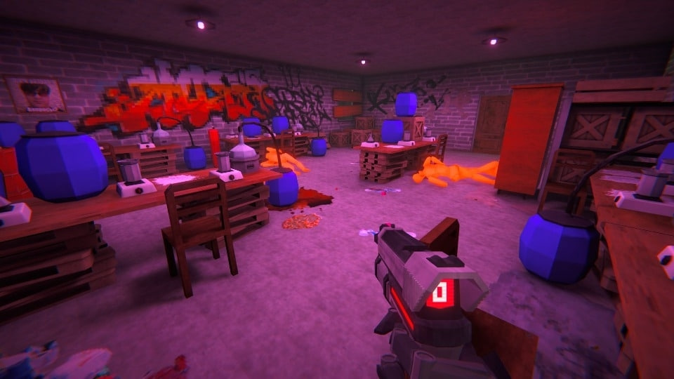

# Hotline Volzskiy README
## Описание проекта
Этот проект представляет собой шутер от первого лица, разработанный с использованием Unity. В игре вы будете взаимодействовать с окружающим миром и противниками, применяя уникальные механики боя.

## Основные особенности
**Примечание:** Приведённые интерфейсы и классы являются лишь частью доступных в игре. Полный список можно найти в исходном коде проекта.
### Система состояний
Игра использует паттерн состояния для управления поведением персонажей и врагов. Ключевые элементы системы состояний включают:

1. **State:** Абстрактный класс, предоставляющий методы для управления состоянием:
- **Enter():** Инициализация состояния.
- **Update():** Обновление состояния в текущем кадре.
- **PhysicsUpdate():** Обновление физики (вызывается 30 раз в секунду).
- **LateUpdate():** Завершение обработки состояния в конце кадра.
- **Exit():** Завершение состояния.
2. **PlayerBaseState:** Абстрактный класс для состояний игрока, включающий:
- **JumpState:** Прыжок.
- **FreeFallState:** Свободное падение.
3. **AIBaseState:** Абстрактный класс для состояний врагов, включающий:
- **AIChasingState:** Преследование.
- **AIPatrolState:** Патрулирование.
- **AIStunState:** Оглушение.
### Диаграмма классов состояний


### StateMachine
Для управления переключением состояний используется класс StateMachine. Этот класс отвечает за управление текущим состоянием и его обновление. Основные свойства и методы включают:

- **CurrentState:** Свойство, которое хранит текущее состояние машины состояний.
- **Initialization(State initialState):** Метод для инициализации начального состояния.
- **ChangeState(State newState):** Метод для изменения текущего состояния на новое.
- **Update():** Метод для обновления состояния в текущем кадре.
- **LateUpdate():** Метод для обновления состояния в конце кадра.
- **PhysicsUpdate():** Метод для обновления физики состояния (вызывается 30 раз в секунду).

### Оружие
Проект использует различные интерфейсы для реализации ключевых механик:

- **IHealthy:** Интерфейс для объектов, имеющих здоровье.
- **IDamageable:** Интерфейс для объектов, которые могут получать урон.
- **ISelectable:** Интерфейс для объектов, которые можно подобрать.
- **INoiseSensitive:** Интерфейс для объектов, реагирующих на шум от источников звука.
- **IStunable:** Интерфейс для объектов, которые могут быть оглушены.
### Интерфейсы
Все виды оружия в игре наследуются от абстрактного класса AdvanceWeapon, который включает следующие события:

- **ShotStart:** Событие, инициирующее выстрел.
- **ShotProcess:** Событие, происходящее во время выстрела.
- **ShotEnd:** Событие, завершающее выстрел.
- **OnEquip:** Событие, происходящее при экипировке оружия.
- **OnUnEquip:** Событие, происходящее при снятии оружия.

## Механика боя
- **Подбор оружия:** Игрок может находить и подбирать оружие в игровом мире или забирать его у врагов.
- **Бросок оружия:** Игрок может бросать оружие в противников, чтобы оглушить их. После оглушения враги теряют своё оружие и переходят на ближний бой.
- **Взаимодействие с врагами:** Враги, потерявшие оружие, начинают использовать ближний бой, что требует от игрока дополнительных стратегий.

## Двери и взаимодействие
- **Закрытые двери:** Все двери в игре изначально закрыты.
- **Открытие дверей:** Для открытия дверей требуется применить ускоренный бег (Run), чтобы их выбить.

## Разработка
- **Моделирование:** Большинство моделей объектов были созданы в Blender.
- **Текстуры:** Все текстуры были созданы с использованием Substance Painter.
- **Звук:** Звуковые эффекты и музыка были настроены в Audacity.

## Установка и запуск
Для запуска игры выполните следующие шаги:
1. Клонирование репозитория:
```bash
    git clone https://github.com/Telanors/hotline-volzskiy.git
```
2. Открытие проекта:
- Откройте Unity Hub.
- Нажмите на кнопку "Open Project" и выберите папку с клонированным репозиторием.

3. Постройка и запуск:
- В Unity Editor, откройте меню File > Build Settings.
- Выберите целевую платформу и нажмите "Build and Run" для создания и запуска игры.

## Демонстрация
### Скриншоты игры



### Видео: 
https://disk.yandex.ru/i/n5i94pZI28JkKQ